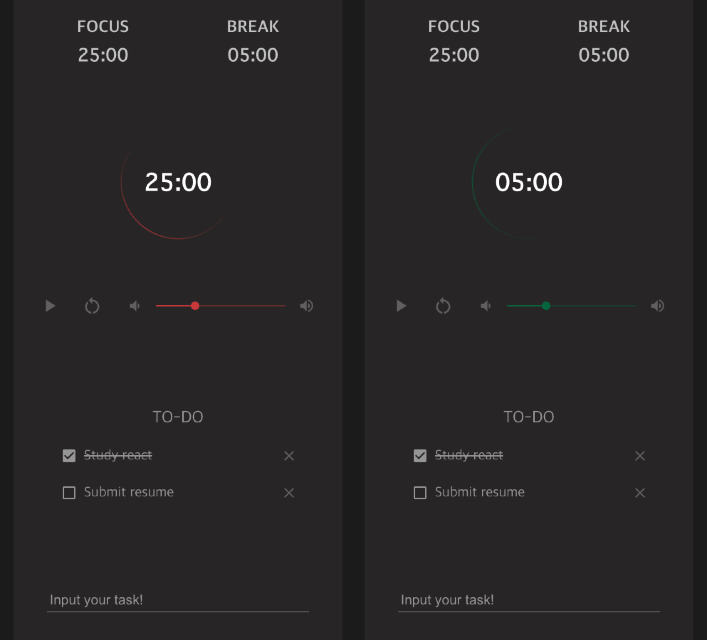

# Pomodoro Timmer

## ⭐️ 機能

### Pomodoro Technique のためのタイマー ⏱

- Pomodoro Technique とは? 25 分の集中と 5 分の休みを繰り返す集中法
- 集中モードと休みモードが自動でスイッチングされるタイマー
- 効果音 🎶 と UI のカーラで(下のイメージ参考)集中モードと休みモードのスイッチングを告知

      <!-- ![images]](https://s3-us-west-2.amazonaws.com/secure.notion-static.com/33e02262-dd0b-4e9a-9980-d86472532e07/Untitled.png) -->

  
     
左: 集中モード(赤)　右: 休みモード(緑)

   

- 集中と休みの時間を調整して自分に合うサイクルも設定可能

### Todo list 🗒

- 今日の課題を記録
- 終わった課題はチェックまたは削除
- Drag&Drop でリスト内の順序の変更が可能

## 🦄 使用言語とツール

<!-- 아이콘들 -->

- HTML
- POST CSS
- JavaScript
- React

## 📚 使用ライブラリとリソース

- [@material-ui/core](https://material-ui.com/) 告知音の音量調整のコントローラーと Todo list のチェックボックス

- [react-beautiful-dnd](https://github.com/atlassian/react-beautiful-dnd) Todo list の drag&drop

- [Google Fonts](https://fonts.google.com/icons) 各種アイコンのリソース

- [Material Design](https://material.io/design/sound/sound-resources.html) 告知音のリソース

This project was bootstrapped with [Create React App](https://github.com/facebook/create-react-app).

## 📖 Project で新しく勉強した事

[JavaScript Scheduling](https://www.notion.so/setTimeout-setInterval-ca77892ac1ab47e7bc85a893a2214b40) \*韓国語の文書

[localStorage & SessionStorage](https://www.notion.so/localStorage-SessionStorage-84651886d39c47a890e4d4b9f6c65ff3) \*韓国語の文書

## 🐛 改善

- ~~再読み込みのボタンを押しても Todo list 保存するように~~

  → sessionStorage を利用してセーブ&ロードするように改善(May 24, 2021)

- ~~Todo list にチェックボックを追加~~

  → 追加(May 24, 2021)

  - 再読み込みのボタンを押すとチェック記録が無くなる問題発生

- タイマーが動いているブラウザーのタブから離れるとカウントダウンが遅くなる
- safari で告知音の自動再生関連のエラー発生
- 集中  モードと休みモードとを切り替えるボタン追加
- 登録済みの ToDo の内容修正を可能に
